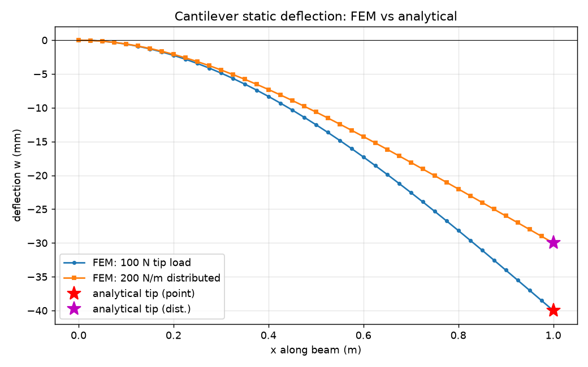
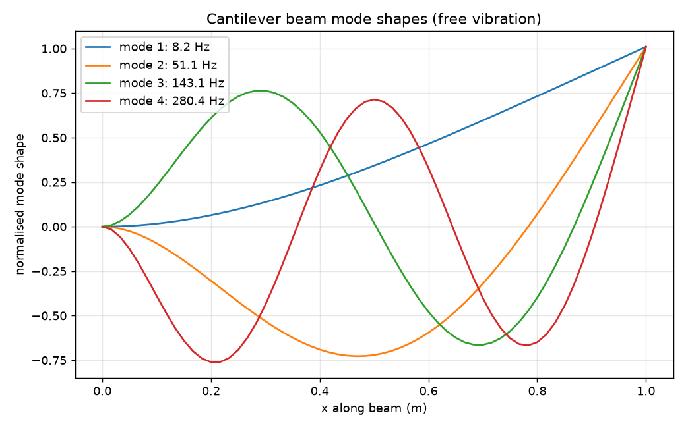
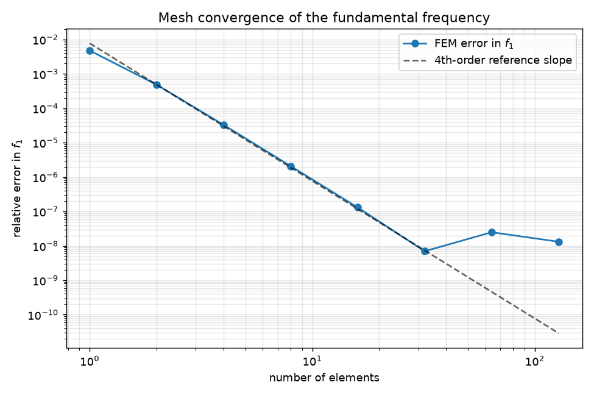
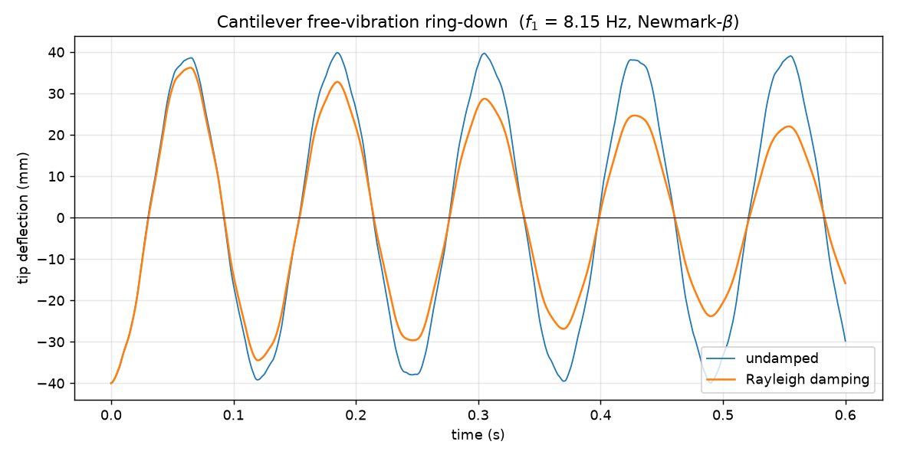
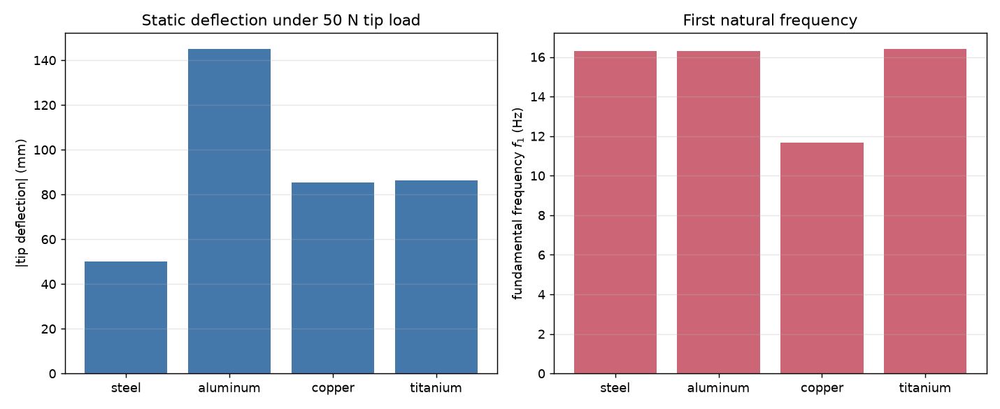
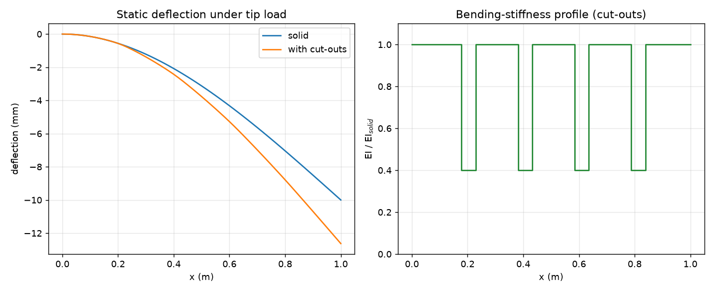

# Finite Element Beam Solver

A Python finite element solver for the bending and vibration of Euler–Bernoulli
beams. It computes static deflection under load, natural frequencies and mode
shapes, and the transient dynamic response in the time domain, together with
material and cross-section trade studies. Results are verified against the
corresponding closed-form analytical solutions.

| Static deflection | Mode shapes | Convergence |
|---|---|---|
|  |  |  |
| **Transient ring-down** | **Material study** | **Cut-out beam** |
|  |  |  |

## Capabilities

| Analysis | Method | Example |
|---|---|---|
| Static bending | `K u = f`, tip and distributed loads | `static_cantilever.py` |
| Modal / free vibration | generalized eigenproblem `K φ = ω² M φ` | `modal_analysis.py` |
| Transient dynamics | Newmark-β time integration with Rayleigh damping | `transient_response.py` |
| Material trade study | parametric sweep over E and ρ | `material_comparison.py` |
| Non-uniform / cut-out sections | per-element `EI` / `ρA` profile | `stepped_beam_cutouts.py` |
| Mesh convergence | error vs element count | `convergence_study.py` |

The solver uses 2-node cubic (Hermite) beam elements with two degrees of freedom
per node (transverse deflection and rotation). Element stiffness and
consistent-mass matrices are assembled into the global system, clamped–free
boundary conditions are applied, and the static, modal, or transient problem is
solved.

## Validation

The solver reproduces the analytical solutions to the precision the theory
predicts, and the independent solvers cross-check one another:

| Check | Result |
|---|---|
| Tip deflection, point load | matches `PL³/3EI` to ~1e-11 (cubic elements are exact for this case) |
| Tip deflection, distributed load | matches `qL⁴/8EI` to ~1e-11 |
| Natural frequencies | match the Euler–Bernoulli `(βL)ₙ` eigenvalues to <1e-6 |
| Convergence | fundamental-frequency error decays at ~4th order with refinement |
| Transient ↔ modal | free-vibration ring-down frequency (8.158 Hz) agrees with the modal `f₁` (8.154 Hz) to 5e-4 |

A representative result from the material study: steel and aluminum have nearly
identical natural frequencies, because frequency scales with the specific
stiffness `√(E/ρ)`, which is almost equal for the two metals — while aluminum
deflects about three times as much under the same load.

## Usage

```bash
pip install -r requirements.txt

python examples/static_cantilever.py     # static deflection vs analytical
python examples/modal_analysis.py        # natural frequencies + mode shapes
python examples/transient_response.py    # Newmark-β ring-down (damped/undamped)
python examples/material_comparison.py   # steel / aluminum / copper / titanium
python examples/stepped_beam_cutouts.py  # cut-out (variable-section) beam
python examples/convergence_study.py     # mesh convergence
python -m pytest                         # validation tests
```

```python
import fem_beam as fb

beam = fb.steel_rectangular(length=1.0, width=0.05, height=0.01, n_elements=40)
x, w = beam.static_deflection(tip_load=-100.0)         # static bending
freqs, shapes = beam.natural_frequencies(4)            # modal analysis
t, tip, hist = beam.transient_response(0.5, 4000,      # transient ring-down
                                       preload_tip=-100.0, rayleigh=(2.0, 2e-5))
```

## Project layout

```
src/fem_beam.py                 core solver: element matrices, assembly,
                                static / modal / Newmark-β transient, sections
examples/                       six runnable studies (figures land in results/)
tests/test_fem_beam.py          analytical-solution and cross-check tests
results/*.png                   generated figures
```

## Stack

Python · NumPy · SciPy · Matplotlib · pytest
